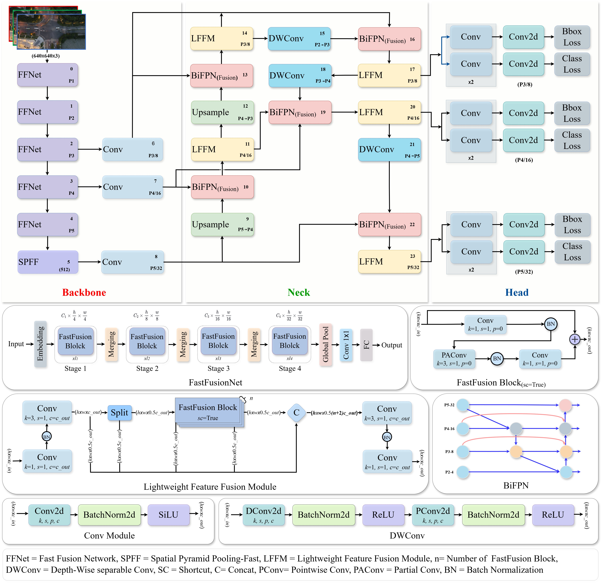

# LiteFPV-SOD

[](https://www.python.org/)
[](https://pytorch.org/)
[](https://developer.nvidia.com/cuda-toolkit)
[](#license)
[](#citation)

Official repository for **LiteFPV-SOD: An Ultra-Lightweight Detector for Real-Time Small-Object Detection on Edge-Deployed FPV Drones**.

LiteFPV-SOD is an ultra-lightweight object detector designed for real-time small-object detection in UAV and FPV-drone imagery. The framework targets challenging aerial scenes where objects are small, visually weak, and affected by high altitude, poor illumination, motion blur, cluttered backgrounds, and low foreground-background contrast.

---

## Code Availability

The complete source code, training scripts, evaluation scripts, deployment scripts, configuration files, and pretrained weights will be uploaded after the paper is accepted.

At the current stage, this repository provides the project description, dataset information, experimental summary, and planned usage instructions for reproducibility.

---

## Highlights

- **Ultra-lightweight detector** for real-time small-object detection on FPV drones.
- **FFNet backbone** for efficient multi-scale feature extraction.
- **Lightweight Feature Fusion Module (LFFM)** for low-cost feature interaction and representation enhancement.
- **BiFPN-based multi-scale fusion** for stronger bidirectional feature aggregation.
- **Depthwise separable convolution (DWConv)** for reduced computational complexity.
- Evaluated on **UAV-SOD**, **VisDrone2019**, and **DOTA-v1.5**.
- Robustness evaluated under **RGB**, **grayscale**, and **synthetic night-vision** conditions.
- Real onboard deployment on an FPV drone with **Raspberry Pi 5**, achieving approximately **20–25 FPS**.

---

## Overall Architecture

LiteFPV-SOD consists of four main components:

1. **FFNet Backbone**  
   Extracts hierarchical multi-scale features while preserving fine-grained spatial information required for small-object detection.

2. **Lightweight Feature Fusion Module (LFFM)**  
   Uses a split-refine-fuse strategy to improve feature interaction while maintaining low computational overhead.

3. **BiFPN-Based Multi-Scale Fusion**  
   Strengthens top-down and bottom-up feature aggregation for objects with large scale variation.

4. **DWConv-Based Efficient Feature Aggregation**  
   Reduces computational complexity by separating spatial filtering and channel mixing.

<p align="center">
  
</p>

---

## Main Results

### Benchmark Results

| Dataset | mAP<sub>50</sub> | mAP<sub>50:95</sub> | Params | FLOPs | Model Size | GPU FPS |
|---|---:|---:|---:|---:|---:|---:|
| UAV-SOD | 53.9 | 34.3 | 4.1M | 14.9G | 8.6 MB | 322 |
| VisDrone2019 | 49.3 | 33.8 | 4.1M | 14.9G | 8.6 MB | 293 |
| DOTA-v1.5 | 50.7 | 35.4 | 4.1M | 14.9G | 8.6 MB | 194 |

> **Note:** GPU FPS values were measured on the workstation GPU platform. Onboard deployment FPS was evaluated separately on the Raspberry Pi 5-based FPV drone platform.

### Onboard Deployment Result

| Platform | Camera | Inference Mode | FPS |
|---|---|---|---:|
| Raspberry Pi 5 + FPV drone | 1080p HD camera | Real-time onboard inference | 20–25 |

---

## Installation

> The complete code will be released after paper acceptance. The following installation instructions are prepared for the official code release.

### 1. Clone the repository

```bash
git clone https://github.com/dhuvisionlab/LiteFPV-SOD.git
cd LiteFPV-SOD
```

### 2. Create environment

Using Conda:

```bash
conda create -n litefpv_sod python=3.8 -y
conda activate litefpv_sod
```

### 3. Install dependencies

```bash
pip install -r requirements.txt
```

Recommended environment:

```text
Ubuntu 20.04
Python >= 3.8
PyTorch 2.2.0
CUDA 11.8
OpenCV
NumPy
PyYAML
tqdm
matplotlib
```

---

## Dataset Preparation

This repository supports three datasets:

- **UAV-SOD**
- **VisDrone2019**
- **DOTA-v1.5**

Expected dataset structure:

```text
datasets/
├── UAV-SOD/
│   ├── images/
│   │   ├── train/
│   │   └── val/
│   └── labels/
│       ├── train/
│       └── val/
│
├── VisDrone2019/
│   ├── images/
│   │   ├── train/
│   │   └── val/
│   └── labels/
│       ├── train/
│       └── val/
│
└── DOTA-v1.5/
    ├── images/
    │   ├── train/
    │   └── val/
    └── labels/
        ├── train/
        └── val/
```

### Data_preprocessing<br>

Raw data must be preprocessed before being fed into the network for training or testing. First, image preprocessing methods such as brightness correction and image filtering are applied to selected sample images to improve dataset quality. Then, the annotation software **LabelImg** is used to draw ground-truth bounding boxes for all object instances in the images. The annotations are saved in YOLO-compatible text format for detector training and evaluation.

Visit this link to download LabelImg:  
https://github.com/HumanSignal/labelImg

### Data_Download<br>

Visit this link to download the dataset:  
https://github.com/dhuvisionlab/SOD-Dataset

### DOTA-v1.5 Annotation Conversion

DOTA-v1.5 uses oriented bounding-box annotations. For LiteFPV-SOD training, the annotations should be converted into horizontal bounding boxes.

```bash
python tools/convert_dota_to_yolo.py   --src datasets/DOTA-v1.5/original_annotations   --dst datasets/DOTA-v1.5/labels
```

---

## Training

> Training scripts and configuration files will be uploaded after paper acceptance.

### Train on UAV-SOD

```bash
python tools/train.py   --config configs/train/train_uav_sod.yaml   --data configs/data/uav_sod.yaml   --model configs/model/litefpv_sod.yaml
```

### Train on VisDrone2019

```bash
python tools/train.py   --config configs/train/train_visdrone.yaml   --data configs/data/visdrone2019.yaml   --model configs/model/litefpv_sod.yaml
```

### Train on DOTA-v1.5

```bash
python tools/train.py   --config configs/train/train_dota.yaml   --data configs/data/dota_v15.yaml   --model configs/model/litefpv_sod.yaml
```

---

## Evaluation

> Evaluation scripts and pretrained weights will be uploaded after paper acceptance.

### Evaluate on UAV-SOD

```bash
python tools/val.py   --weights weights/litefpv_sod_uav_sod.pt   --data configs/data/uav_sod.yaml   --img 640
```

### Evaluate on VisDrone2019

```bash
python tools/val.py   --weights weights/litefpv_sod_visdrone.pt   --data configs/data/visdrone2019.yaml   --img 640
```

### Evaluate on DOTA-v1.5

```bash
python tools/val.py   --weights weights/litefpv_sod_dota.pt   --data configs/data/dota_v15.yaml   --img 640
```

---

## Robustness Evaluation

LiteFPV-SOD supports robustness evaluation under grayscale and synthetic night-vision conditions.

> Robustness preprocessing scripts will be uploaded after paper acceptance.

### Generate grayscale dataset

```bash
python tools/make_grayscale_dataset.py   --src datasets/UAV-SOD/images   --dst datasets/UAV-SOD-Grayscale/images
```

### Generate synthetic night-vision dataset

```bash
python tools/make_night_vision_dataset.py   --src datasets/UAV-SOD/images   --dst datasets/UAV-SOD-NightVision/images
```

### Evaluate robustness

```bash
python tools/val.py   --weights weights/litefpv_sod_uav_sod.pt   --data configs/data/uav_sod_grayscale.yaml   --img 640
```

```bash
python tools/val.py   --weights weights/litefpv_sod_uav_sod.pt   --data configs/data/uav_sod_nightvision.yaml   --img 640
```

---

## Inference

> Inference scripts will be uploaded after paper acceptance.

### Image inference

```bash
python tools/infer_image.py   --weights weights/litefpv_sod_uav_sod.pt   --source assets/demo.jpg   --img 640   --conf 0.25
```

### Video inference

```bash
python tools/infer_video.py   --weights weights/litefpv_sod_uav_sod.pt   --source assets/demo.mp4   --img 640   --conf 0.25
```

---

## Model Profiling

To measure FLOPs, parameters, inference time, and FPS:

```bash
python tools/profile_model.py   --weights weights/litefpv_sod_uav_sod.pt   --img 640   --device 0
```

---

## Raspberry Pi / FPV Drone Deployment

LiteFPV-SOD was deployed on an FPV drone platform using a Raspberry Pi 5 and a 1080p HD camera module.

> Raspberry Pi deployment scripts will be uploaded after paper acceptance.

### Install on Raspberry Pi

```bash
cd deployment/raspberry_pi
bash install_rpi.sh
```

### Run real-time camera inference

```bash
python deployment/raspberry_pi/camera_inference.py   --weights weights/litefpv_sod_rpi.pt   --camera 0   --img 640   --conf 0.25
```

### FPS test

```bash
python deployment/raspberry_pi/fps_test.py   --weights weights/litefpv_sod_rpi.pt   --camera 0
```

---

## Pretrained Weights

Pretrained weights will be released after manuscript acceptance.

| Model | Dataset | Download |
|---|---|---|
| LiteFPV-SOD | UAV-SOD | Coming soon |
| LiteFPV-SOD | VisDrone2019 | Coming soon |
| LiteFPV-SOD | DOTA-v1.5 | Coming soon |
| LiteFPV-SOD | Raspberry Pi deployment | Coming soon |

---

## Repository Structure

The planned repository structure is shown below. The complete code will be uploaded after the paper is accepted.

```text
LiteFPV-SOD/
├── assets/
├── configs/
│   ├── data/
│   ├── model/
│   ├── robustness/
│   └── train/
├── deployment/
│   └── raspberry_pi/
├── docs/
├── litefpv_sod/
│   ├── data/
│   ├── engine/
│   ├── models/
│   └── utils/
├── results/
├── tools/
├── weights/
├── README.md
├── requirements.txt
├── environment.yml
├── LICENSE
└── CITATION.cff
```

---

## Citation

If this work is useful for your research, please cite our paper:

```bibtex
@misc{jobaer2026litefpvsod,
  title        = {{LiteFPV-SOD}: An Ultra-Lightweight Detector for Real-Time Small-Object Detection on Edge-Deployed {FPV} Drones},
  author       = {Jobaer, Sayed and Muzahid, A. A. M. and Hussain, Muhammad Ather Iqbal and Ahmed, Foysal and Tang, Xue-song and Gan, Yuan and Bai, Xiaoshan and Habib, Tushar MD Ahasan and Ahmed, Kh Shaikh and Shaha, Rony and Das, Sayekat Kumar and Han, Hua and Sohel, Ferdous},
  year         = {2026},
  note         = {Preprint},
  url          = {https://github.com/dhuvisionlab/LiteFPV-SOD}
}
```


## Acknowledgements

This work is partly supported by the Natural Science Foundation of Shanghai, China, and the National Natural Science Foundation of China.

---

## License

The license will be updated before the official public release.

---

## Contact

For questions about the code, dataset access, or deployment, please open an issue in this repository.

Repository:

```text
https://github.com/dhuvisionlab/LiteFPV-SOD
```
